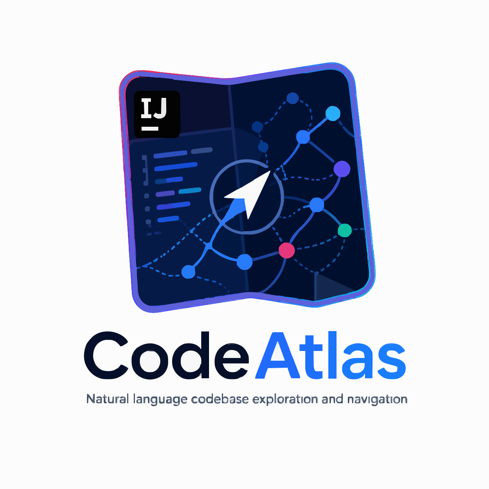

<p align="center">
  
</p>

<h1 align="center">CodeAtlas</h1>

<p align="center"><em>Natural-language code navigation for IntelliJ IDEA.</em></p>

Ask questions like _"where is authentication implemented?"_ or _"how does the payment flow work?"_ and jump straight to the matching class, method, or top-level function. Optionally, get a streamed natural-language answer with citation-clickable sources.

## Features

- **Semantic search over Kotlin and Java**, fully offline. Powered by a locally-bundled INT8-quantized [BGE-small](https://huggingface.co/Xenova/bge-small-en-v1.5) ONNX embedding model running through ONNX Runtime in the IDE process.
- **Right-click _Ask CodeAtlas_** in the editor to query the current selection or the symbol at the caret.
- **Optional retrieval-augmented answers** with clickable citations. Bring your own LLM provider — Anthropic, OpenAI, or local [Ollama](https://ollama.com/). API keys live in IntelliJ's PasswordSafe.
- **Persistent per-project, per-model index cache.** Index once, reuse across IDE restarts. Switch embedders without losing prior caches.
- **Tools menu actions:** Focus Search, Rebuild Index, Clear Cache and Rebuild.

## Install

Until the plugin is on the JetBrains Marketplace, install from disk:

1. Build the plugin ZIP:
   ```bash
   ./gradlew buildPlugin
   ```
   On Windows: `./gradlew.bat buildPlugin`. The artifact lands at `build/distributions/CodeAtlas-1.0.0.zip`.
2. In IntelliJ IDEA: **Settings → Plugins → ⚙ → Install Plugin from Disk…** and pick the ZIP.

## First-time setup

The bundled embedding model and tokenizer are required for semantic search. Both are loaded from `src/main/resources/model/` at build time. They are not committed to git (binary files), so a fresh clone needs them downloaded once before `buildPlugin`:

```bash
curl -fL -o src/main/resources/model/bge-small-en-v1.5-int8.onnx \
  https://huggingface.co/Xenova/bge-small-en-v1.5/resolve/main/onnx/model_quantized.onnx

curl -fL -o src/main/resources/model/tokenizer.json \
  https://huggingface.co/Xenova/bge-small-en-v1.5/resolve/main/tokenizer.json
```

See [`src/main/resources/model/MODEL_CARD.md`](src/main/resources/model/MODEL_CARD.md) for source URLs, expected sizes, and SHA-256.

If the plugin starts up and these files are missing from the JAR, it falls back to a one-time download from Hugging Face into the IDE system path. That fallback path requires network access.

To enable the optional **Ask** feature, configure an LLM provider under **Settings → Tools → CodeAtlas**:

- **Anthropic** — paste your key from [console.anthropic.com](https://console.anthropic.com/settings/keys), pick a model.
- **OpenAI** — paste your key from [platform.openai.com](https://platform.openai.com/api-keys), pick a model.
- **Ollama** — point at your local endpoint (default `http://localhost:11434`), pick a model you've pulled.

Use the **Test connection** button to verify before saving.

## Usage

- The CodeAtlas tool window lives on the right edge after install.
- Type a question in the search bar — results stream in after a 300 ms idle window or immediately on Enter.
- Click a result to jump to the symbol; **double-click** or **Enter** also navigates.
- Right-click in the editor → **Ask CodeAtlas** to query the selection or the identifier at the caret.
- Click **Ask** in the tool window to get a streamed natural-language answer; click citations like `[2]` to jump to the cited source.

## Build from source

Requires JDK 21.

```bash
./gradlew clean test            # unit + IntelliJ-fixture tests
./gradlew runIde                # spin up a sandbox IDE with the plugin
./gradlew buildPlugin           # produce the marketplace ZIP
./gradlew verifyPlugin          # run the plugin verifier
```

See [`AGENTS.md`](AGENTS.md) for the coding standards and [`devdocs/plan.md`](devdocs/plan.md) for the original architecture notes.

## License

[MIT](LICENSE).
