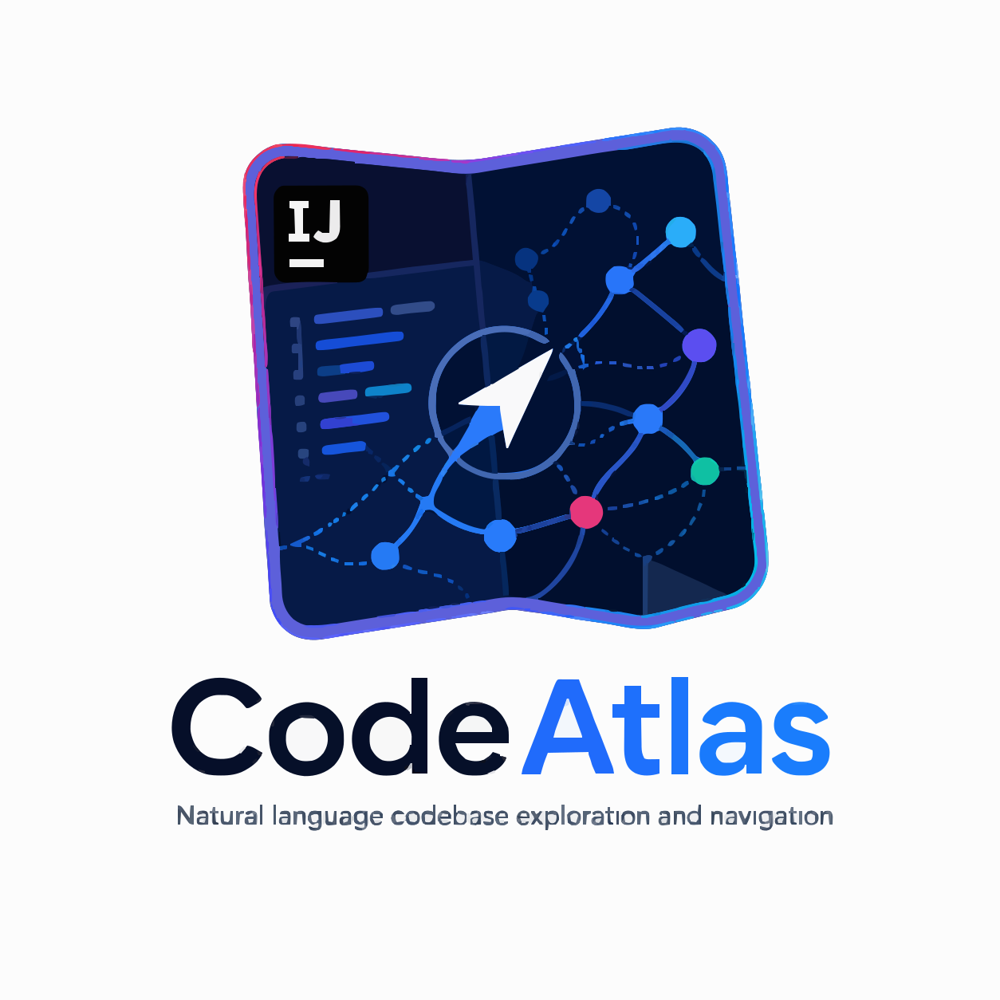
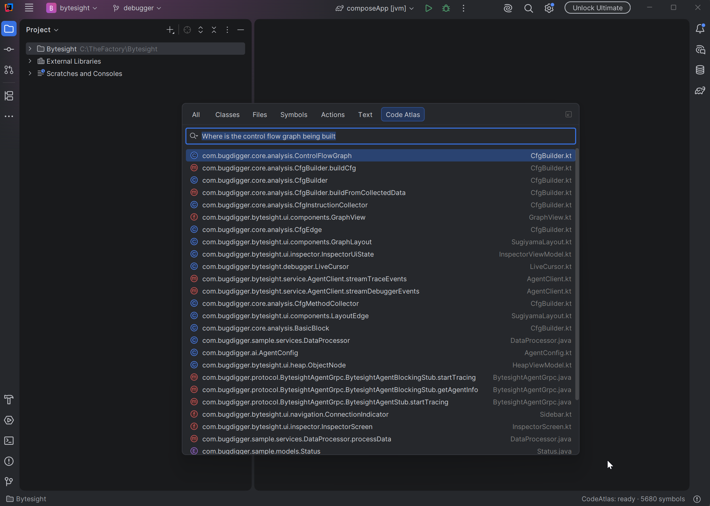

<p align="center">
  
</p>

<h1 align="center">CodeAtlas</h1>

<p align="center"><em>Natural-language code navigation for IntelliJ IDEA.</em></p>

<p align="center">
  <a href="https://plugins.jetbrains.com/plugin/31457-codeatlas">
    
  </a>
  <a href="https://plugins.jetbrains.com/plugin/31457-codeatlas">
    
  </a>
</p>

Press **Shift-Shift**, switch to the **Code Atlas** tab, and ask questions like _"where is authentication implemented?"_ or _"how does the payment flow work?"_ — jump straight to the matching class, method, or top-level function.

## Features

- **Semantic search over Kotlin and Java**, fully offline. Powered by a locally-bundled INT8-quantized [BGE-small](https://huggingface.co/Xenova/bge-small-en-v1.5) ONNX embedding model running through ONNX Runtime in the IDE process. No API keys, no network calls.
- **Search Everywhere integration.** Lives as a dedicated tab in IntelliJ's Search Everywhere popup (Shift-Shift). No extra tool window competing for screen space.
- **Status-bar widget.** Shows index progress (`indexing 412/9 800` → `ready · 5 678 symbols`); click it to open the Code Atlas tab or kick off a rebuild.
- **Right-click _Search with CodeAtlas_** in the editor to query the current selection or the symbol at the caret.
- **Persistent per-project, per-model index cache.** Index once, reuse across IDE restarts. Switch embedders without losing prior caches.
- **Tools menu actions:** Focus Search, Rebuild Index, Clear Cache and Rebuild.
- **Model Context Protocol (MCP) server.** Exposes the active project's index over a local HTTP endpoint so external AI hosts — Claude Desktop, Claude Code CLI, Cursor — can call CodeAtlas as a tool.

<p align="center">
  
</p>

## Install

Requires IntelliJ Platform 2026.1 or newer.

**From the JetBrains Marketplace** ([plugin page](https://plugins.jetbrains.com/plugin/31457-codeatlas)):

In IntelliJ IDEA, open **Settings → Plugins → Marketplace**, search for `CodeAtlas`, and click **Install**.

**From disk** (for local builds or pre-release ZIPs):

1. Build the plugin ZIP:
   ```bash
   ./gradlew buildPlugin
   ```
   On Windows: `./gradlew.bat buildPlugin`. The artifact lands at `build/distributions/CodeAtlas-1.0.0.zip`.
2. In IntelliJ IDEA: **Settings → Plugins → ⚙ → Install Plugin from Disk…** and pick the ZIP.

## First-time setup

The bundled embedding model and tokenizer are required for semantic search. Both are loaded from `src/main/resources/model/` at build time. They are not committed to git (binary files), so a fresh clone needs them downloaded once before `buildPlugin`:

```bash
curl -fL -o src/main/resources/model/bge-small-en-v1.5-int8.onnx \
  https://huggingface.co/Xenova/bge-small-en-v1.5/resolve/main/onnx/model_quantized.onnx

curl -fL -o src/main/resources/model/tokenizer.json \
  https://huggingface.co/Xenova/bge-small-en-v1.5/resolve/main/tokenizer.json
```

See [`src/main/resources/model/MODEL_CARD.md`](src/main/resources/model/MODEL_CARD.md) for source URLs, expected sizes, and SHA-256.

If the plugin starts up and these files are missing from the JAR, it falls back to a one-time download from Hugging Face into the IDE system path. That fallback path requires network access.

## Usage

- Press **Shift-Shift**, switch to the **Code Atlas** tab. Type a natural-language question or a code-like query.
- **Enter** on a row jumps to the symbol at its declaration site.
- The status-bar widget (bottom of the IDE) shows index state. Click it while the index is _ready_ to open the Code Atlas tab; click while it's empty/building to (re-)trigger a full index.
- Right-click in the editor → **Search with CodeAtlas** opens the Code Atlas tab pre-filled with the selection or the identifier at the caret.
- Tools menu → **CodeAtlas** has **Focus Search** (Shift-Shift shortcut to our tab), **Rebuild Index**, and **Clear Cache and Rebuild**.

## MCP server

CodeAtlas runs an embedded [Model Context Protocol](https://modelcontextprotocol.io/) server on `127.0.0.1` so other AI tools can query your local index. The server starts automatically when the plugin loads (one server per IDE instance, shared across all open projects — tool calls always target the most recently focused one).

### Tools exposed

- **`search_code`** — semantic search over the active project's index. Args: `query` (string, required), `limit` (1–50, default 10), `include_snippet` (bool, default true). Returns a JSON array of ranked hits with file path, qualified name, kind, signature, score, and (optionally) the source snippet.

### Connecting a host

Open **Settings → CodeAtlas → MCP server** and click **Copy Claude Desktop config**. The clipboard receives:

```json
{
  "mcpServers": {
    "codeatlas": { "url": "http://127.0.0.1:64340/mcp" }
  }
}
```

Paste into `%APPDATA%\Claude\claude_desktop_config.json` (Windows) or `~/Library/Application Support/Claude/claude_desktop_config.json` (macOS) and restart Claude Desktop. The same URL works with any MCP host that supports the streamable HTTP transport.

The default port is `64340`; change it in the same settings panel if it conflicts. Disable the server entirely by unchecking **Enable MCP server**.

## Settings

Under **Settings → Tools → CodeAtlas**:

- **Include test sources in indexing** — off by default; turn on to include `src/test/...` content in search results.
- **Cache directory override** — use a non-default location for the persistent index cache (advanced).
- **MCP server** — enable/disable, port, status, and the **Copy Claude Desktop config** button.

## Build from source

Requires JDK 21.

```bash
./gradlew clean test            # unit + IntelliJ-fixture tests
./gradlew runIde                # spin up a sandbox IDE with the plugin
./gradlew buildPlugin           # produce the marketplace ZIP
./gradlew verifyPlugin          # run the plugin verifier
```

See [`AGENTS.md`](AGENTS.md) for the coding standards and [`devdocs/plan.md`](devdocs/plan.md) for the original architecture notes.

## License

[MIT](LICENSE).
